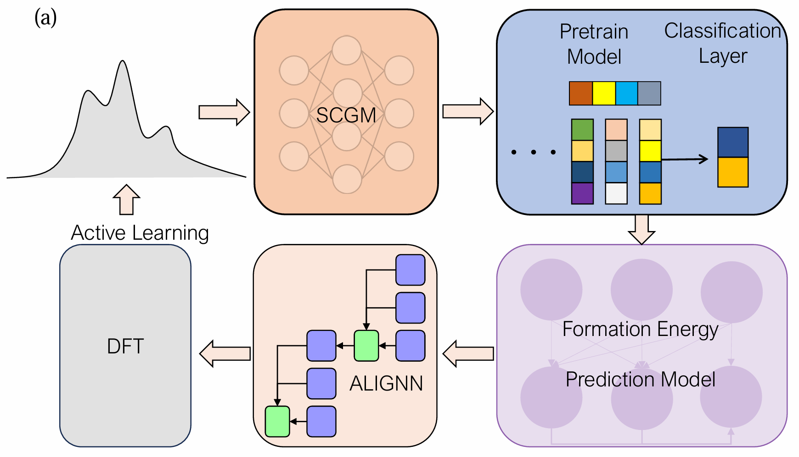

# AI-accelerated discovery of high critical temperature superconductors

[**[Paper]**](https://arxiv.org/pdf/2409.08065)




### User Guide
InvDesFlow can be used for the inverse design of functional materials, and we have conducted a series of experiments on high-temperature superconductors. InvDesFlow utilizes functionalities from multiple repositories (DiffCSP, MatAltMag, MEGNet, ALIGNN), each with different runtime environments. Users need to set up corresponding environments, which may not be very user-friendly. We aim to address this issue in future improvements. We will provide scripts to make the integration between functionalities smoother.

### Generate functional materials

Before training the generative model, you need to set up the [DiffCSP](https://github.com/jiaor17/DiffCSP/tree/main) environment. We can train a generative model for functional materials using our private dataset. Here is a script that converts a directory containing CIF files into the DiffCSP data format. Run:

```
python cif2dataset.py --cif_dir your_cifs_data_dir --dataset_name your_dataset_name
```

Go to `~/DiffCSP/conf/data`, create a parameter file named `your_dataset_name.yaml` based on the settings in `mp_20.yaml`, and then start training:

```
cd ./DiffCSP
python diffcsp/run.py data=your_dataset_name   model=diffusion_w_type   expname=your_expname
```
Crystal generative models are generally divided into crystal structure prediction and ab initio generation. Since we need to design new functional materials, we need to train an Ab Initio Generation model. The `model=diffusion_w_type` above refers to ab initio generation.
Next, you can generate materials based on the trained model. Before inference, two pieces of information are required:  
1. Obtain the atomic number distribution of the functional materials and add it to the `~/DiffCSP/scripts/generation.py` file. We have provided an example of atomic number distribution statistics in `InvDesFlow.ipynb`.  
2. Add the learning rate corresponding to your dataset in the `~/DiffCSP/scripts/eval_utils.py` file. Typically, it can be set to `5e-6`, the same as for "mp_20". To alleviate memory issues caused by generating too many materials at once, we provide a script for iteratively submitting tasks. Run:
```
python generation_crystal.py --device 0 --count 200 --model_path your_model_path --dataset your_dataset_name
```
`--count 200` means to run the inference 200 times, with each run generating 1000 structures.
The generated crystals are stored in `.pt` file format. Here, we provide an example to convert the `.pt` file into a `.cif` file in `InvDesFlow.ipynb`.

### Determine the stability of materials.
1. Clone the [MEGNet](https://github.com/davidtangGT/MEGNET) repository to your local machine:
   ```bash
   git clone https://github.com/davidtangGT/MEGNET
   ```
2. Follow the instructions in the repository to install and activate the required environment.
3. After activating the environment, `cd` into the MEGNet project directory:
   ```bash
   cd MEGNET
   ```
4. Copy our script (e.g., `pred_formation_energy.py`) into the MEGNet project directory.
5. In the script, set the following two parameters:
   ```python
   cif_dir = ''  # Path to your CIF files directory
   run_name = '' # Name of the run (can be any string you choose)
   ```
6. Then simply run the script:
   ```bash
   python pred_formation_energy.py
   ```
   
### Predict the superconducting transition temperature of materials.
The ALIGNN project integrates models for predicting various materials properties. You can find all the available pretrained models for property prediction in [`alignn/alignn/pretrained.py`](https://github.com/usnistgov/alignn/blob/main/alignn/alignn/pretrained.py).
For example, to predict the superconducting transition temperature, follow these steps:
1. First, convert the CIF file generated by your generative model into a VASP POSCAR file. You can ask a GPT model to help implement this conversion script if needed.
2. Then, run the following command to predict the property for a **single crystal**:
   ```bash
   pretrained.py --model_name jv_supercon_tc_alignn --file_format poscar --file_path  /path/your_file.vasp
   ```
3. To predict properties for **multiple crystals**, you can write a simple loop to call the above command repeatedly.

 
### Data Description
#### 1. **Candidate Superconducting Materials**
- **Location**: `.Data/candinate_supercon/`
- **Description**: This directory contains files related to the 74 candidate superconducting materials that we have predicted. These materials are being evaluated for their potential to exhibit high-temperature superconductivity.

#### 2. **Training Data for Generative Models**
- **Location**: `./Data/data_materials.csv`
- **Description**: This file contains data on 105 superconducting materials that we have used to train our generative models. These materials serve as the basis for the development of AI-driven methods to predict new superconducting materials.


### Acknowledgments

The main framework of this codebase is built upon [DiffCSP](https://github.com/jiaor17/DiffCSP), [MatAltMag](https://github.com/zfgao66/MatAltMag/tree/main), [MEGNet](https://github.com/davidtangGT/MEGNET), and [ALIGNN](https://github.com/usnistgov/alignn).

### Citation

Please consider citing our work if you find it helpful:
```
@misc{han2024aiaccelerateddiscoveryhighcritical,
      title={AI-accelerated discovery of high critical temperature superconductors}, 
      author={Xiao-Qi Han and Zhenfeng Ouyang and Peng-Jie Guo and Hao Sun and Ze-Feng Gao and Zhong-Yi Lu},
      year={2024},
      eprint={2409.08065},
      archivePrefix={arXiv},
      primaryClass={cond-mat.supr-con},
      url={https://arxiv.org/abs/2409.08065}, 
}
```
